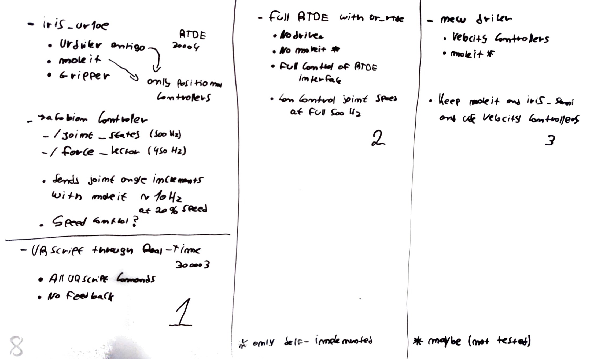
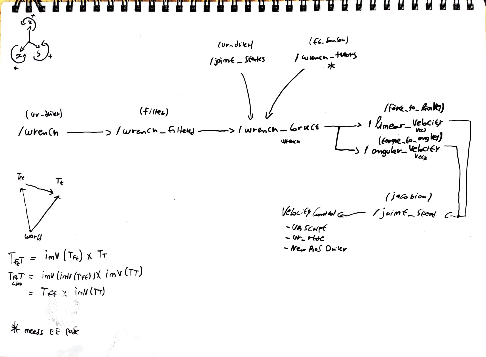

# Logbook

## 10/11 - Pesquisar papers (Bronze)

 - Encontrei +30 papers sobre interação de robots industriais e humanos. Guardei para futura leitura e resumo
   - Sites de papers científicos
     - ResearchGate
     - IEEEXplore 
     - Science Direct 
 - Encontrei 3 sites com recursos interessantes para o tema 
   - RIA - https://www.robotics.org/
   - UR - https://www.universal-robots.com/
   - A3 - https://www.a3automate.org/

## 11/11 - Reunião (IRISlab)

 - Com o Prof Nuno Lau e Bernardo Cunha
 - Apresentação do Projeto Augmanity, composição do sistema, datas e entregáveis
 - Escrita da tese fica para o final do desenvolvimento
 - Início do logbook

#### **Tarefas** 

- Passagem de objeto do robot para humano
  - Utilização de posiçoes pré definidas
  - Leitura do sensor de 3 eixos do end-efector para o robot largar o objeto

## 16/11 - Pesquisa (Posto)

 - Ao pesquisar sobre o sensor de força do end-efector (TCP), descobri que o driver oficial publica no tópico /wrench os valores que lê do sensor

## 17/11 - Teste (IRISLab)

  - Ao iniciar um novo workspace com o repositório do driver oficial, o driver inicia sem problema, e publica no tópico /wrench 3 valores de força e 3 valores de torque.

 - Existe no entanto o problema de não consegui conectar o MoveIt ao robot, com erros variados
   
   - Um deles estava relacionado com a ausência de um ficheiro de calibração interna, que após o obter, resolvi o problema
   
 - Ao tentar dar merge do novo driver com o repositório do Eurico, os erros persistiram

 - Ao tentar dar merge novamente em casa, consegui compilar o projeto e executar sem problemas no gazebo. Penso que é esperado visto que os problemas estão maioritariamente no driver do robot real

#### Repositórios Importantes

   - Eurico -  https://github.com/iris-ua/iris_ur10e
   - UR Driver - https://github.com/UniversalRobots/Universal_Robots_ROS_Driver
   - UR Description e MoveIt (recomendado) - https://github.com/fmauch/universal_robot/tree/calibration_devel
     - Este possui um branch interessante "moveit" cuja pasta ur10e_moveit_config é mais recente que todas as outras
   - UR Description e MoveIt (oficial) - https://github.com/ros-industrial/universal_robot

****

- Criei 3 workspaces diferentes. 1 com o driver do eurico (iris_ws). 1 com o driver oficial (ros_ws). 1 onde vou tentar dar merge dos 2 (merge_ws)

## 18/11 - Reunião (IRISLab)

- Ao tentar adaptar o merge_ws para os parametros do iris_ws (que funciona) reparei numa linha do ur10e_bringup.launch onde, por alguma razao, o force_torque_sensor_controller nao estava incluido na lista de controladores. Ao incluir, o driver já publica os valores do sensor para o tópico /wrench. Vou prosseguir com a utilização do iris_ws, deixando a adaptação do merge_ws para depois.
- Implementação do planeador STOMP no iris_ws
- Adaptação do nó ArmControl ao ambiente (remoção de código relativo ao iris_cork)
- Valores de torque do tópico /wrench são cartesianos e e relativos ao tool0_controller mas os valores iniciais não são claros. O y inicia com um valor demasiado alto e a rotação do end-effector não parece impactuar esses valores.
- Afinal, apos reinicar o robot e ler logo a seguir os valores de /wrench, ficam todos muito próximos de 0
- Após algum tempo a testar, é nítido que a cada reboot do robot, os valores iniciais de força são inicializados a zero. Como era de esperar, diferentes posiçoes do gripper provocam alteração nos valores de força (os valores podem alterar-se até +/- 10) permanecendo nesse estado. Os valores não parecem ser absolutos, mas sim relativos à posição inicial em que o robot é ligado
- Várias reinicializações do driver não provocam alteração nos valores de força
- Muito possivelmente, a melhor forma de utilizar os valores deste sensor, será apenas utilizando a diferença de força com o tempo, pois se o gripper se mantiver estável, os valores variam em +/- 1 sendo que a aplicação de uma força adequada por parte do utilizador ao gripper, provoca variação nos valores em +/- 15 (Newtons?)
- Valores de torque ainda são uma incógnita -> Já não são uma incógnita. Valores de torque representam forças circulares aplicadas ao end efector
- Alterar a orientação do gripper faz com que os valores de força se alterem... Mesmo o robot estando estático

#### Tarefas

- Recolher valores do sensor tendo em conta a variação de
  - Poses de inicialização do robot
  - Várias poses do robot
  - Várias orientações do gripper
  - Com e sem um um objeto

****

- 4 bags gravados (wrench3, wrench10, all3, all10)
- Testes com novo nó tests.py para criar diferentes conjuntos de posições

## 19/11 - IRISLab

- À medida que o tempo passa, o sensor de força vai acumulando erros e, sem mexer no robot, os valores vão-se afastando linearmente de como são inicializados (0,0,0)

- Programa de testes em que o EE se mexe em XYZ sem alterar orientação provoca forças irrelevantes no sensor

- Recalibração do TCP

  - Valores actuais - {Payload: 1.77kg, CX: -5.0, CY: 0.0, CZ: 45.0}
  - Calibração 1 - {Payload: 1.67kg, CX: -3.0, CY: 0.0, CZ: 41.0}
  - Calibração 2 - {Payload: 1.84kg, CX: -1.0, CY: 1.0, CZ: 37.0}
  - Calibração 3 - {Payload: 1.84kg, CX: -5.0, CY: -5.0, CZ: 38.0}
  - Calibração 4 - {Payload: 1.73kg, CX: -3.0, CY: 2.0, CZ: 49.0}
  - Calibração 5 - {Payload: 1.69kg, CX: 10.0, CY: 0.0, CZ: 39.0
- **Agora com o Gripper Fechado**
  - Calibração 6 - {Payload: 1.76kg, CX: -1.0, CY: -3.0, CZ: 40.0}
  - Calibração 7 - {Payload: 1.67kg, CX: -1.0, CY: 3.0, CZ: 48.0}
  - Calibração 8 - {Payload: 1.63kg, CX: 1.0, CY: -5.0, CZ: 47.0}
- **Agora Reinicializando o Robot**
  - Calibração 9 -  {Payload: 1.72kg, CX: -2.0, CY: -8.0, CZ: 40.0}
  - Calibração 10 -  {Payload: 1.69kg, CX: -8.0, CY: -2.0, CZ: 40.0}
- Após várias tentativas de calibração, decidi usar os valores atuais mas centrar o TCP em X = 0

## 2/12 - IRISLab

- Estudo dos valores de força do sensor, gráficos em screenshots -> wrench
  
- Pasta 1-wrench
  
  - Movimentos simples em XYZ sem aplicar rotação do EE, provocam oscilações quando o robot se está a mover. Valores oscilam entre [-5, 6]
  - Rotações do EE provocam maiores oscilações e estes valores permanecem alterados, após a rotação. Ver screenshots
    - TESTE - Mover 3 vezes, pi/4 graus - Mover -3\*pi/4 graus - Mover 3 vezes, -pi/4 graus - Mover 3\*pi/4 graus
    - NOTA - Rotações positivas, EE roda no sentido horário
    - RESULTADO - A posição do EE influencia a amplitude dos valores e nota-se um padrão constante nas 3 posições experimentadas
  - Alteração do peso do payload
    - TESTE - Alterar o peso do payload para 1.4kg
    - RESULTADO - A amplitude dos valores diminuiu em X mas aumentou em Y
    - TESTE - Alterar o peso do payload para 1kg
    - RESULTADO - Houve uma alterção nos valores de X (como que uma inversão), e a amplitude de valores em Y aumentou significativamente
    - TESTE - Alterar o peso do payload para 2kg
    - RESULTADO - Mais uma vez, os valores em X inverteram-se, e a amplitude de valores em Y diminuiu
    - NOTA - O problema não parece estar apenas relacionado com peso mas também com o centro de gravidade
  - Recalibrar o peso e centro de gravidade do TCP
    - Novos valores -  {Payload: 1.71kg, CX: -1.0, CY: 0.0, CZ: 41.0}
    - RESULTADO - Exatamente o mesmo do primeiro teste de rotação
    - Novos valores - {Payload: 1.79kg, CX: 3.0, CY: 2.0, CZ: 36.0}
    - RESULTADO - Exatamente o mesmo do primeiro teste de rotação
  - Testar os movimentos simples em XYZ após uma rotação revela o esperado, ou seja, inicialmente, os valores alteram-se drasticamente na rotação, no entanto, durante as translações, as oscilações são muito menores
  - Alteração do Centro de Gravidade
    - TESTE - Alterar para X = 0, Y = 0, Z = 0
    - RESULTADO - Exatamente o mesmo do primeiro teste de rotação
    - TESTE - Alterar para X = 50, Y = 50, Z = 50
    - RESULTADO - Exatamente o mesmo do primeiro teste de rotação
- Alterar o valor do peso do payload ou qualquer componente do centro de gravidade do TCP faz com que o controlador do sensor reinicie os seus valores a zero, por menor que seja a alteração, qualquer que seja, provoca um reset
****

  - Repositório iniciado com o iris_ws -> https://github.com/fabioalves98/HumanRobotColaboration
  - Programa wrench.py faz agora display dos valores num gráfico em tempo real no modo live

## 3/12 - IRISLab

  - Ver os resultados em tempo real não ajudou a obter novas conclusões
  - Os valores de força que o controlador interno do robot publica, são relativos ao eixo da base robot. O nó ur_hardware_interface, antes de publicar para /wrench, multiplica estes valores pelo transform da pose do TCP para obter os valores de força em relação ao TCP

  ## 4/12 - IRISLab

  - Guardados 3 novos bags 
    - wrench_pushes.bag - Onde o gripper agarra num pedaço de cortiça e eu puxo em várias direções com diferentes níveis de força
    - wrench_taps.bag - Leves toques rápidos nos lados do gripper
    - wrench_twists.bag - Onde ao agarra no gripper o tento rodar em várias direções para testar a sensibilidade dos valores de torque

  ## 7/12 - Posto

  - Descobri um serviço que reinicializa o sensor de força e torque (zero_ftsensor) e outro que reenvia um programa URScript ao robot (resend_robot_program), útil para quando o robot entra em protective stop ou emergency stop

  - Encontrei Issues no Github do driver do UR10e muito parecidos com o problema

    - [Strange FT sensor readings with nothing mounted on the end of the]: https://github.com/UniversalRobots/Universal_Robots_ROS_Driver/issues/294
    - [Problem on force_torque_sensor_controller, and its topic /wrench]: https://github.com/UniversalRobots/Universal_Robots_ROS_Driver/issues/269

  - Programa wrench integra os valores de /wrench em tempo real para detetar corretamente uma interação com o robot

  #### Tarefas

  - Filtar os valores de ruído e fazer uma função de integração que detete corretamente forças e toques rápidos
    - Moving Average Filter - https://maker.pro/arduino/tutorial/how-to-clean-up-noisy-sensor-data-with-a-moving-average-filter
    - Kalman Filter - ?

  ## 9/12 - Reunião (IRISLab)

  - Programa wrench avalia os valores de força e consoante a força aplicada em cada eixo, abre ou fecha o gripper. Valor de força é parametrizavel.
    - No eixo X (lateral), uma força em qualquer dor sentidos fecha o gripper
    - No eixo Y e Z (frontal, uma força no sentido do utilizador abre o gripper
  - Continua o mesmo problema em que se o EE rodar, os valores alteram-se
    - O driver obtem os valores de FT atraves de um cliente RTDE que comunica com um servidor presente no controlador interno do UR10e. Esse servidor publica os valores de força que calcula em relação ao eixo do robot, e depois o driver transforma-os para a pose do TCP
  - Para solucionar, é possível usar a nova função que integra os valores e aplica um filtro de média para controlar o gripper. Desta forma o controlo do gripper nao é afetado pelas sucessivas rotações e movimentos do robot e acumulações de erro do sensor FT

## 17/12 - Teste (IRISLab)

- Nova tentativa de resolver o problema do wrench. Retirar os valores de força em todos os angulos possiveis, por num gráfico, tentar descobrir um padrão a fim de compensar o comportantomento anómalo do controlador

- Pasta 2-wrench

- Posiçoes

  - P1 - out_of_camera
  - P2 - P1 -> rotate 0 -pi/4 0
  - P3 - P1 -> rotate 0 -pi/2
  - P4 - P1 -> rotate 0 -3/4 0
  - P5 - P1 -> rotate 0 pi/4 0
  - P6 - P1 -> rotate 0 0 pi/4
  - P7 - P1 -> rotate 0 0 -pi/4

- Testes

  - Teste 1 | Posição 1 | zero_ftsensor quando wrist3_joint está a 0       |-180 a 180

  - Teste 2 | Posição 1 | zero_ftsensor quando wrist3_joint está a -180 | -180 a 180

  - Teste 3 | Posição 1 | zero_ftsensor quando wrist3_joint está a 180  | -180 a 180

  - > Fixar os eixos do gráfico para todos os testes ficarem com os mesmos eixos

  - Teste 4   | Posição 1 | zero_ftsensor quando wrist3_joint está a 0       | -180 a 180

  - Teste 5   | Posição 2 | zero_ftsensor quando wrist3_joint está a 0       | -180 a 180

  - Teste 6   | Posição 3 | zero_ftsensor quando wrist3_joint está a 0       | -180 a 180

  - Teste 7   | Posição 4 | zero_ftsensor quando wrist3_joint está a 0       | -180 a 180

  - Teste 8   | Posição 5 | zero_ftsensor quando wrist3_joint está a 0       | -180 a 180

  - Teste 9   | Posição 6 | zero_ftsensor quando wrist3_joint está a 0       | -180 a 180

  - Teste 10 | Posição 7 | zero_ftsensor quando wrist3_joint está a 0       | -180 a 180
  
- Inconclusivos

## 18/12 - Teste (IRISLab)

- Nova tentativa de resolver o problema do wrench. Fazer os mesmos testes anteriores mas sem o gripper attached ao robot
- Pasta 3-wrench
- Posições
  - P1 - Joints [0, -90, 0, 0, 0, 0] 
  - P2 - Joints [0, -90, 0, 0, 90, 0]
  - P3 - Joints [0, -90, 0, 0, -90, 0]
  - P4 - Joints [0, -90, 0, 0, -45, 0]
  - P5 - Joints [0, -90, 0, 0, 45, 0]
  - P6 - out_of_camera
  - P7 - init_calibration
  - P8 - desk_pick
- Novo gráfico com valores de torque

## 08/01 - Desenvolvimento (BMIlhavo)

- Programa fit.py que dessenha 3 funções seno, configuradas de maneira diferente de modo a tentar aproximar as curvas obtidas nos programas de teste do wrench.py
- Curvas aparentam ter proximidade com os gráficos do wrench.py

## 13/01 - Reunião (IRISLab)

- Novos testes com persistencia dos resultados em memória, sem gripper
- Pasta F-wrench
- Posições
  - P1 -  Joints [0, -90, 0, 0, 90, 0]
  - P2 -  Joints [0, -90, 0, 0, 45, 0]
  - P3 - Joints [0, -90, 0, 0, 0, 0] 
  - P4 - Joints [0, -90, 0, 0, -45, 0]
  - P5 -  Joints [0, -90, 0, 0, -90, 0
- Média e desvio padrão das diferenças dos resultados
  - Mean - [ 0.41535386,  0.4073297 ,  0.48555393]
  - Std Dev - [ 0.07199976,  0.07887803,  0.09579287]

#### To Do

- Verificar repetibilidade dos testes
- Verificar se dar resest em angulos de wrist_3 diferentes provoca os mesmos resultados
- Verificar o drift do sensor, tanto temporal como espacial
- Verificar os valores de TCP Force pelo URScript
- Dar fit de uma função seno nos resultados
  - Método dos mínimos quadrados
- Criar modelo que aplique a função para corrigir a variância dos valores de força

****

## 01/03 - IRISLab

#### Repetibilidade

- Repetição dos testes para verificar repetibilidade dos resultados
- Pasta F-wrench (repeat)
- Posições e diferença de valores comparado com os testes anteriores
  - P1 - Joints [0, -90, 0, 0, 90, 0] 
    - Mean - [ 0.20678017,  0.49250442,  0.29758366]
    - Std Dev - [ 0.16025934,  0.125027  ,  0.21015851]
  - P2 - Joints [0, -90, 0, 0, 45, 0] 
    - Mean - [ 0.29473815,  0.69158735,  0.89929321]
    - Std Dev - [ 0.17148463,  0.43221503,  0.27771454]
  - P3 - Joints [0, -90, 0, 0, 0, 0]
    - Mean - [ 0.30978849,  0.37630247,  0.34874062]
    - Std Dev - [ 0.18629143,  0.18554891,  0.18170008]
  - P4 - Joints [0, -90, 0, 0, -45, 0] 
    - Mean - [ 0.13864991,  0.2199402 ,  0.5447835]
    - Std Dev - [ 0.09905205,  0.16799613,  0.25183081]
  - P5 -  Joints [0, -90, 0, 0, -90, 0]
    - Mean - [ 0.35275194,  0.41744611,  0.24365676]
    - Std Dev - [ 0.21623916,  0.33241225,  0.18720336]
- Média e desvio padrão das diferenças dos resultados
  - Mean - [ 0.48826575,  0.48218191,  0.70701964]
  - Std Dev - [ 0.11487946,  0.14974243,  0.16440651]
- **Resultado - **Todos os testes aparentam ser passíveis de ser repetidos e apresentar os mesmos valores
  - Média e desvio padrão do conjunto dos 10 testes
    - Mean - [ 0.43229188,  0.47148803,  0.56602416]
    - Std Dev - [ 0.07462753,  0.15599019,  0.10256855]

#### Dar reset noutro sítio e sobrepor os valores

- Teste T6 - Posição P5 - /zero_ft_sensor chamado com wrist_3 = -75
- Resulta em curvas com o mesmo padrão mas deslocadas verticalmente
- Utilizando o fit.py para dar plot de T5 e T6
- **Resultado - **Se compensarmos T6 com o valor de T5 em wrist_3 = 75, obtemos T5 com pouca variabilidade de (< 0.5N)

#### Drift Temporal

- Teste TD - Posição P2/P3/P4 - /zero_ft_sensor chamado com wrist_3 = 0
- Gravar valores durante 10 minutos sem movimento
- **Resultado - **Os valores variam linearmente com o tempo

## 02/03 - IRISLab

- Peso do Gripper - 1.336 Kg
- Peso do Encaixe do Gripper - 0.178 g
- Peso do Conjunto - 1.514 Kg

#### Drift Posicional

- Teste TP - Posição P1 - /zero_ft_sensor chamado com wrist_3 = 0
- Mover o braço para uma posição random - "out_of_camera"
- Aplicar 180 graus de rotação no wrist_3
- Voltar para a posição P1
- Correr o teste sem dar reset no inicio do teste
- **Resultado - **Comparando com o teste default T1_P1 não há variância notável nos resultados
- Correr o teste mas dar reset no início do teste
- **Resultado - **Comparando com o teste default T1_P1 não há variância notável nos resultados

#### Fit de uma Função Seno

- Aplicação da função curve_fit da bilbioteca scipy, com uma função custumizada seno com 4 parametros
  - y = p1 * np.sin(np.radians(p2 * (x + p3))) + p4
  - Amplitude, frequencia, offset_x, offset_y
- Definição de valores de guess iniciais
- **Resultado - ** Parametros finais
  - x - [3.59403687, 2.16328845, -56.15475734, 2.55574389]
  - y - [1.18181371,  2.16484226, 39.16549121, -0.45171281]
  - z - [1.96991165,  2.00442201, 41.65549264, -2.1853712 ]

## 03/03 - IRISLab (Reunião)

- Tentativa de corrigir os valores de força vindo do wrench em tempo real
- Problemas no geral. Possíveis causas
  - Maneira de obter o valor do wrist_3 do robot
  - Problema de velocidade dos tópicos
  - Problema em acesso com exclusividade mutua aos valores no wrench.py
- **Reunião - To Do**
  - Dar merge das curvas com gripper e sem gripper
  - Fazer modelo teórico de como o gripper se deverá comportar em diferentes orientações
    - Parametros seriam a orientação do gripper, peso e centro de gravidade
  - Usar esse modelo teórico, repetir os testes e melhorar o modelo com testes
  - Vídeos - https://www.youtube.com/c/EnergidTechnologies/videos

## 05/03 - IRISLab

- Repetição dos teses com o Gripper attatched
- Pasta F-Wrench
- Mesmas 5 posições que anteriormente
- Mais uma Bónus - out_of_camera

#### Testes com valores diferentes de Payload e COV

- Diferetes valores de payload alteram drasticamente os valores do sensor
- Diferentes valores de centro de gravidade não alteram os valores do sensor

#### Merge das Curvas com e sem Gripper

- Valores de diferença entre curvas originais e com gripper fazem algum sentido, mas não são suficientes para retirar
  - Valores de diferença em X, fazem sentido pois a posição wrist_3 = 0 tem o eixo X alinhado verticalmente, ou seja, quando ha o zerto_ft_sensor(), todo o peso do gripper está sobre esse eixo, e há medida que rodamos, esse peso vai passando para o eixo Y, logo é normal que o valor de X aumente
  - A parte estranha é que o valor de Y não se altera em todo o teste
  - Ainda mais estranho, é que o valor de Z se altera
- Uma possível explicação é que estes 2 testes diferem no valor configurado de payload
  - Quando foram medidos sem gripper - Payload era 0Kg
  - Quando foram medidos com gripper - Payload era 1.77Kg
- **Resultado - **Inconclusivo

## 06/03 - Casa

- Refactor do workspace com os pacotes iris_sami e iris_ur10e
- Refactor de código com helper functions

## 07/03 - Casa

- Paper - Human–robot interaction in industrial collaborative robotics: a literature review of the decade

## 08/03 - IRISLab

#### Testes com diferentes valores de payload sem Gripper

- Pasta F-Wrench
- Teste Payload | Posição 1 | Payload de x Kg
- TP1_0Kg
  - Igual ao teste default
- TP1_0.2Kg e TP1_1Kg
  - Exatamente igual a TP1_0Kg
- TP2_0Kg
  - Igual ao teste default
- TP2_0.2kg e TP2_1Kg
  - Apresentam diferenças significativas em relação a TP2 que fazem todo o sentido
- Repetição para a P3 com resultados analogos a P1, ou seja, as diferenças foram ainda maiores
- **Resutlado -** Após verificação dos resultados corrigidos faz todo o sentido
  - Ao adicionarmos valores falsos de payload, eles vão ser retratados nas curvas

****

#### Teste com Payload 0 com e sem gripper (sem dar reset entre os testes)

- Posição B - [0, -90, -90, 0, 0, 0]
- Teste Payload | Posição B | Payload de x Kg
- TPB_0Kg
  - Igual ao teste default
- TPBG_0Kg
  - Diferenças extremas devido ao acopulamento do gripper, os valores fazen sentido, no geral
  - Força com que o gripper é acopulado ao end effector interfere com os valores de Z
- **Restulado - **Compensasão dos valores obtidos com a acopulação do gripper demonstram curvas sinosoidais realistas e cujos valores fazem sentido
  - Obtenção do peso do gripper fazendo primeiro
    - Compensasão da component Z com a sua média
    - A raiz dos quadrados das 3 compoentes
    - Obtemos a cada posição de wrist_3 a magnitude do vector forca 
    - Fazendo a média obteve-se o valor de 15.13 N
    - O peso do conjunto é de 1.514 Kg

****

#### Testes com diferentes valores de payload com Gripper

- Obter o melhor valor de peso para inserir no payload
- Posição B - [0, -90, -90, 0, 0, 0]
- Teste Payload | Posição B | Payload de x Kg
- Testados payloads de 1.2kg a 1.8Kg com intervalos de 100g
- Objetivo é ver qual payload é que produz a curva mais aproximada à curva de correção
- **Resultado - **Nenhuma curva de aproxima completamente mas as mais próximas em termos de média e desvio padrão são 1.5Kg e 1.6kg que é aproximadamente o peso do gripper
  - Os desvios poderão estar a ser causados pelo COG

## 09/03 - IRISLab

#### Testes com diferentes valores de COG com gripper

- Testar impacto de COG nas curvas obtidas
- Teste COG | Posição [1, 2, 3]
  - Center of Gravity com 0mm em todas as componentes
  - Center of Gravity com 100mm em todas as componentes
  - Center of Gravity com 200mm em todas as componentes
- **Resultado - **Parece haver alguma variação mas nem suficientemente grande que necessite de ser corrigida, nem apresenta um padrão definido

#### Testes com Gripper em diferentes posições e payloads

- Testar o efeito de diferentes valores em diferentes posições
- Teste Payload | Posição [1, 2, 3, 4, 5] | Payload [0, 1.5, 3]
- **Resultado**
  - Tanto na posição 1 como 5 as curvas não apresentaram diferenças cosoante a alteração do payload, como era esperado
  - Nas posições 2, 3 e 4 as curvas apresntam diferenças nas magnitudes esperadas
  - No entanto, quando corrigidas em 1.5kg (peso real do gripper) apresentam algumas oscilações que terão que ser corrigidas

## 15/03 - IRISLab

#### Obter melhor peso do Gripper com várias posições e payloads

- Voltar a tentar testar o melhor valor de payload introduzido no robot para ver se é possível obter uma única curva em várias posições
- A curva do gripper não tem que ser necessariamente igual à curva sem gripper, no entanto, não pode mudar consoante a posição
- Teste Gripper | Posição 1 [1, 2, 3, 4, 5]  | Payloads [1.4, 1.5, 1.6]
- **Resultado**
  - Os testes são repetíveis - caso de exemplo 1.5kg
  - Estas diferenças no payload são representadas nos resultados, sendo que 1.5Kg é o valor que mais se aproximo à curva default (sem gripper)

## 16/03 - IRISLab

#### Conjunto extenso de poses de forma abrangir o maior número de orientações

- Array de angulos - [-180, -135, -90, -45, 0, 45, 90, 135, 180]
- 2 ciclos de iteração por este array e atribução de valor de junta a wrist_1 e wrist_2
- Total de 70 posições

#### Modelo teórico do comportamento do sensor de força quando o gripper está acopulado

- 3 vetores com a orientação do Sensor
- 1 vetor com magnitude e orientação da gravidade
- Calcular teoricamente cada componente do vetor gravidade em cada 1 dos 3 eixos do sensor FT

## 17/03 - IRISLab

#### Conclusão do modelo teórico do sensor

- Utilização do produto interno dos vetores normalizados anteriormente definidos para calculo do valor da força em cada componente

## 18/03 - IRISLab

#### Teste de COG no robot real

- Com uma tabua de um metro acopulada ao gripper numa posição horizontal, colocar em ambas as extremidades um peso de ~1Kg para ver se a força sentida pelo sensor é a mesma
  - Apesar de não ser exatamente a mesma, as diferenças não sao significativas nem apresentam um padrão
  - Obviamente o torque sentido pelo sensor é inverso quando colocamos o objeto do lado contrário da tábua

#### Teste de Correção do Gripper

- Em cada 1 das 70 posições de writs_1 e wrist_2 fazer o wrist_3 girar em 360 e obter os resultados obtidos com o modelo teórico
- Nas mesmas 70 posições obter os resultados obter os resultados com o robot real com gripper e um payload de 1.5Kg
- Fazer um merge e criar um modelo de correção, sendo que em cada posição do robot real, o valor de força deve ser 0

## 19/03 - Reunião

- Continuar

## 23/03 - IRISLab

#### Teste Correção do Sensor FT

- Pasta F-Wrench

- 70 posições reduzidas para 57 por causa de duplicados (180 = -180) e posições impossíveis de posicionar o robot (colisões)
- Teste Correct | Wrist_1 {0 - 135, 45} | Wrist_2 {0 - 135, 45} 
- TCx_w1_w2 
  - Teste das 57 posições sem gripper e Payload 0kg

- **Resultado - **Maioria destes testes inutilizáveis devido a uma atenuação dos valores das curvas por motivos desconhecidos
  - Alguns testes com gripper com valores inutilizáveis devido à pressão feita pelo cabo do gripper nas posições mais extremas

## 24/03 - IRISLab

- A razão pela qual os testes anteriores estavam a apresentar uma atenuação nos valores das curvas devese ao facto da fila que guardava os valores de força estar a aumentar de tamanho, para o sobro a cada teste

#### Teste Correção Gripper (Repeat)

- Pasta F-Wrench
- 70 posições reduzidas para 57 por causa de duplicados (180 = -180) e posições impossíveis de posicionar o robot (colisões)
- Teste Correct | Wrist_1 {0 - 135, 45} | Wrist_2 {0 - 135, 45} 
- TCx_w1_w2 
  - Teste das 57 posições sem gripper e Payload 0kg
- TCG_w1_w1
  - Teste das 57 posições com gripper e Payload 1.5kg (sem cabo)
- **Resultado**
  - Testes sem gripper tem divergências muito pequenas entre si, sendo possível extrair uma curva média de todos os testes sendo que o máximo de erro que poderá existir será de 1.5N
  - Tests com gripper apresentam divergências entre si muito maiores, sendo que para utilizar estes dados num modelo de correção teríamos que adicionar a orientação do gripper

## 25/03 - IRISLab

#### Modelo de Correção do Sensor FT

- Retirar a média dos testes sem gripper
- Corrigir os testes com gripper com a curva média dos testes sem gripper e guardar os valores resultantes numa matriz
- Utilizar esses valores para corrigir o sensor tendo em conta que a orientação do end effector tem que entrar na equação

#### Bags de Coreção com e sem gripper

- correct_no_gripper_px.bag - 5 bags sem gripper nas 5 posições deafult
- correct_gripper_px.bag - 5 bags com gripper nas 5 posições default
- Em cada bag o robot posiciona-se na posição indicada e roda o wrist_3 em 360
- **Erro - **bags apenas gravaram /wrench e não /joint_states - Inutilizável

#### Setup Kinect para deteção de gestos

- http://wiki.ros.org/mit-ros-pkg/KinectDemos/HandDetection

## 26/03 - IRISLab

#### Pesquisa relativa a controlo por gestos

- Muita utilização de leap motion controllers
- Kinect muito utilizada para gestos com o corpo todo

#### Melhoramento da geração de várias posições para o end effector

- Cada valor de wrist_1 tem agora uma cor associada para ser mais facil fazer a distinção 

#### Controlo do Gripper através de Força

- Controlo simples por peso - **Funciona**
- Controlo por eixo - **Funciona**
  - Força no X fecha
  - Força no Y abre
- Controlo quando lida com objetos - **Funciona +/-**
  - Variável está a agarrar algo?
    - Pois apenas o controlo por força ns eixos fica desiquilibrado quando o robot está a agarrar algo
  - Quando está a agarrar algo, a maneira de abrir o gripper tem que ser diferente
    - Quando mede uma força no sentido contrário à orientação do gripper - **Funciona**
    - Quando mede um peso próximo de zero - **Funciona +/-** (objetos mais pesados)
      - **Problema** de quando pega em objetos mais leves
      - **Problema** do utilizador fazer uma força sobre o objeto que não faça o valor de peso passar pelo threshold
- **Problema** de quando dar reset ao sensor
  - Periodicamente quando for observável que nada está a interagir com o robot, e que não tem nenhum objeto agarrado

## 30/03 - IRISLab

#### Modelo de Correção do Sensor FT

- Necessidade de uma matriz que relacione os valores das várias posições do end effector
- Cada teste apenas dá os valores de correção relativos à posição da junta wrist_3
- Para criar um modelo que possa corrigir os valores em qualquer orientação é preciso algo que relacione as orientações
- TCG_correct
  - Teste das 57 posições em que a cada iteração o robot é posicionado numa posição default [0, -90, 0, 0, 0, 0]
  - É feito o zero_ft_sensor()
  - O robot move-se para a dada posição e o valor de força é medido
- **Resultado - **É notável a diferença de valores de força que existe entre a posição default e cada uma das posições, e estas diferenças teram que ser contabilizadas no modelo de correção

## 31/03 - IRISLab

#### Controlo por gestos

- Segmentação da point cloud vinda da kinect utilizando primeiro um cropbox, facilitado por uma bounding box, em que apenas se visualiza a mesa
- Utilização de Euclidean Clustering para segmentar a nova cloud, obtendo apenas 2 clusters que correspondem às mãos / braços
- viewer.cpp

## 05/04 - IRISLab

#### Modelo de Correção do Sensor FT
- Incluir a função de reset
- Utilizar numa fase inicial a média das curvas com gripper
- Criação de um conjunto de vetores correspondentes a cada uma das 56 posições para comparação com a orientação corrente do EE

**VERIFICAR TESTES DAS 56 POSIÇÕES COM GRIPPER E VERIFICAR POSSÍVEIS ERROS**

- Divisão do wrench.py em filter.py (filtro de média com janela de 30 valores) e record.py (programa que move o wrist_3 de -180 a 180 e guarda os valores do sensor FT)

## 06/04 - IRISLab

#### Testes nas 56 posições com Gripper e Payload 0

- Comparar com os testes "sem gripper" e "com gripper e payload 1.5" para tentar chegar a uma conclusão

****

- Melhoramento do programa record.py para garantir que os valores de força são corretamente gravados em cada posição do wrist_3

## 07/04 - IRISLab

#### Modelo de Correção do Sensor FT

- Seja qual for o payload, pode-se considerar como curvas de correção as curvas obtidas em testes onde o EE está verticalmente alinhado com o ambiente, ou seja, ao rodar o wrist_3, nenhuma força deverá ser exercida sobre os 3 eixos XYZ em qualquer posiçào de wrist_3
- Curva de correção feita através das posições de indices 2, 6, 34 e 38 (Posições onde o EE está verticalmente orientado)
- Gravação de testes com o modelo teórico para comparação com os testes reais

##### Neste momento exitem 4 tipos de curvas

- Curva de correção posicional do Wrist3  (proveniente da média das curvas das posições de indices 2, 6, 34, 38)
- Curva de teste das 56 posições com gripper e Payload 1.5Kg
- Curva de teste das 56 posições com gripper e Payload 0Kg
- Curva de teste das 56 posições provenientes do modelo teórico

****

- Implementação da função reset com o modelo de correção

## 12/04 - IRISLab

- GUI em GTK para os serviços do iris_sami

## 13/04 - IRISLab

#### Modelo de Correcção do Sensor FT

- Fazendo a compraração entre as curvas do teste teórico com as curvas com payload 0, vemos que existe um padrão entre as diferenças do 2 testes
  - Em X, se **diminuirmos** a amplitude do modelo teórico em +/- 10%, aproximamos os modelo teórico aos valores reais
  - Em Y, se **aumentarmos** a amplitude do modelo teórico em +/- 10% aproximamos o model teórico aos valores reais
  - Em Z, as diferenças são causadas por outros fatores, pois o modelo teórico, nos testes executados é sempre 0
    - Necessita de outro tipo de correção - também divido à força com que é acopulado o gripper ao EE
- Modelo completamente implementado no programa correct.py
  - Corrige possicionalemnte com o angulo do wrist_3
  - Corrige orientacionalmente com o modelo teórico
  - Função de reset implementada nas 2 fases

#### Correções finais ao Modelo

- Corrigir modelo teórico com os resultados obtidos
  - Obter um valor (os tais +/- 10%) para corrigir o modelo teórico
  - Testes inicias com simples médias das diferenças
    - X = 0.846 e Y = 1.115
    - Possibilidade de obter melhores resultados com metodo dos mínimos quadrados
- Corrigir o eixo Z 
  - Fazer um test onde se faça variar o EE em torno de X ou Y de forma a obter os valores reais de Z
  - Comparar com o modelo teórico
  - Obter o offset criado pela força com que se apertou o gripper
  - Obter o desvio de amplitude provavelmente existente (tal como X e Y)
- Corrigir o drift

## 15/04 - IRISLab

#### Modelo de Correção do Sensor FT

- Antes de aplicar os fatores de correção

  - Mean Mean - **[ 1.30804571  1.50272948  1.576232  ]**
    Mean Std - [ 0.34988912  0.50012359  0.46279643]
    Mean Max - [ 2.24789183  2.51883549  3.06942575]

    Std Mean - **[ 0.81536524  0.93259604  0.99550626]**
    Std Std - [ 0.2548648   0.31685171  0.33100798]
    Std Max - [ 1.41419107  1.48037816  1.6792048 ]

    Max Mean - **[ 2.92629354  3.01282345  3.47414803]**
    Max Std - [ 0.86005843  0.99741032  0.9491934 ]
    Max Max - [ 4.6716544   4.6230199   5.58771009]

- Necessário fazer mais testes para corrigir Z

  - Z parece ser afetado diretamente por X
  - Utilizando o mesmo fator de correção que em X ( -0.154 )

- Após aplicar o fator de correção em XYZ

  - Mean Mean - **[ 0.6251545   0.59968417  0.61334835]**
    Mean Std  - [ 0.30244126  0.32259647  0.26306484]
    Mean Max  - [ 1.5099673   1.38590574  1.27972879]

    Std  Mean - **[ 0.33315744  0.24697093  0.32907034]**
    Std  Std  - [ 0.08915038  0.09833696  0.10477162]
    Std  Max  - [ 0.75        0.75        0.67033111]

    Max  Mean - **[ 1.52328022  1.1413761   1.48248086]**
    Max  Std  - [ 0.41916193  0.39568526  0.40593537]
    Max  Max  - [ 2.56008408  2.00279845  2.24928167]

****

- Z também é afetado por um fator proporcional ao
  - Nevessário fazer mais testes isoladamente ao eixo Z para o encontrar

## 16/04 - Reunião

#### Modelo de Corrreção do Sensor FT

- Testes isolados ao eixo Z

- Fixar o wrist_3 numa posição e fazer rodar o wrist_2 sobre um dos eixos Y ou X

- **Resultado - **Fator de correção de Z = 1.230

- Todos os fatores têm que ser melhorados com o metodo dos quadrados minimos

- É necessário criar um conjunto de testes de treino, onde se iram retirar os fatores de correção e um cojunto de testes de validação onde os parametros possam ser testados

  - Os fatores de correção devem ser referentes tanto aos exos isolados como entre eixos (XZ ou YZ)

- Até agora os fatores de correção obtidos com médias de diferenças retiradas das observações são

  - theory[:,z] += theory[:,x] * 0.154

    theory[:,x] = theory[:,x] * 0.846

    theory[:,y] = theory[:,y] * 1.115

    theory[:,z] = theory[:,z] * 1.230

#### Controlo do Gripper através de Forças

- Criação do vetor peso para atribuir açoes ao gripper beaseadas nesse vetor

#### Tarefas

- Controlo do Robot pelos movimentos de força
  - Fazer com que quando o robot pegue numa peça, isole o peso dela, para que as forças sentidas sejam utilizadas para controlar o seu movimento
  - Real time motion planning

## 19/04 - IRISLab

- Refactor do modelo teórico

#### Controlo do Gripper através de Forças

- Utilização do vetor peso para que em conjunto com o vetor gravidade controlar a açao do gripper largar um objeto

## 20/04 - IRISLab

#### Controlo do Robot através de Forças

- Direct communication with robot
  - RTDE - https://www.universal-robots.com/articles/ur/interface-communication/real-time-data-exchange-rtde-guide/
  - URScript through socket - https://www.zacobria.com/universal-robots-zacobria-forum-hints-tips-how-to/script-via-socket-connection/
  - ur_rtde - https://sdurobotics.gitlab.io/ur_rtde/
- Inverse Kinematics
  - MovIt - http://docs.ros.org/en/melodic/api/moveit_tutorials/html/doc/robot_model_and_robot_state/robot_model_and_robot_state_tutorial.html
  - Jacobian - https://www.rosroboticslearning.com/jacobian#:~:text=Jacobian%20is%20Matrix%20in%20robotics,(%20)%20of%20a%20robot%20manipulator.&text=Each%20column%20in%20the%20Jacobian,variation%20in%20each%20joint%20velocity
  - Orocos KDL - https://www.orocos.org/wiki/orocos/kdl-wiki.html

## 21/04 - IRISLab

#### Jacobian Theory

- Introduction to jacobian matrix
- Move it robot state, ik and jacobian tutorial made
- Start experimenting with movements in simulated ur10e (gazebo). **Problems**
  - Gazebo só publica o estado do robot a 50Hz, ou seja, o ciclo de calculo de juntas do robot apenas pode correr num máximo de 50Hz
  - Gazebo apenas aceita controlo de movimento através de valores de juntas, ou seja, requer o moveit para enviar valores de juntas -> mais lento
    - Enviar movimento sincronamente faz com que o movimento do robot seja aos solavancos, pois, entre cada movimento há o tempo de calculo do proximo
    - Enviar movimentos assincronamente funciona mas é necessário encontrar a frequencia certa/ótima para enviar os movimentos, senao o robot "encrava"

## 22/04 - IRISLab

#### Jacobian Simulation

- Envio de valores de juntas asincronamente ao robot através do moveit
- Maioria dos movimentos são fluídos mas há certas posições onde o robot "falha" em calcular a trajetoria
  - Ou por exceder o limite das juntas
  - Ou por exceder o limite de alcance
  - Ou por nao conseguir mesmo se mover nessa dada direção
- Há a necessidade de controlar as juntas do robot por velocidade em ves de por posição

## 23/04 - IRISLab

#### Jacobian Real UR10e

- O controlador funciona um pouco melhor pois os valores das juntas são publicados a 500Hz
- Ainda hà alguns solavancos, mas são muito suaves
- Controlador integrado com o peso calculado para que o robot se mova na direção que está a ser empurrado
  - Resultados positivos
  - Apenas há numa diferença na velocidade com que o EE se move dependendo da força que esta a ser execida e da sua posição
    - Pode ser resolvido efetuando o controlo das juntas por velocidade

## 26/04 - IRISLab

#### URScript and RTDE Interfaces

- Envio de instrucoes em URScript para o Robot através de sockets pela interface Real-Time 30003
  - Tentativa de utilização do pacote pip python-urx mas é preferível enviar os comandos manualmente
  - Robot recebe e executa bem as intruções
  - Falta testar a velocidade com que se consegue interagir com o robot
- Utilização da bilblioteca C++ ur_rtde para interagir com o robot
  - Bilbioteca muito completa com muitas funcionalidades
  - No entanto o robot apenas suporta uma ligação à porta 30004 simultaneamente o que significa que o driver não pode estar ligado, pois este tambem usa a interface RTDE

## 27/04 - IRISLab

#### URDriver mais recente

- Experimentação da versao mais recente do ur_robot_driver que contem controladores de velocidade
  - Tanto controladores poderosos em PID como os de posição, tal como um controlador direto de velocidade das juntas do robot

## 28/04 - IRISLab

#### URSim em Virtual Machine

- Simulador oficial do UR10e que providencia todas as interfaces e funcionalidades do robot real (excepto controlos por força)
- Aceita comandos URScript
- Boa plataforma para testes de interação com o robot

## 30/04 - Reunião

#### Jacobian Weight Real UR10e

- Testes com vários parametros de controlo assincrono da posição do robot
- Comportamento actual é aceitável na medida em que as trajetorias calculadas são precisas
  - No entanto existe delay, a velocidade é muito lenta, e é necessário ser adaptada à força que se faz (quanto mais força, mais rápido)
- Necessário incorporar movimentos rotacionais utilizado o torque

#### Multiple Control Interfaces

#### Reunião

- Necessidade de implementar controlador com velocidades de juntas
- Implementar movimentos angulares com os valores de torque
- Fazer o robot pegar em algo e depois move-lo com a força
- Dar reset no peso quando o robot pega em algo (dar um X tempo de calibração)
- Implementar double-tap
- Tentar distinguir entre mover o EE e pegar numa peça (relação torque / força)

## 05/05 - IRISLab

#### Movimentos angulares com os valores de torque

- Tentativa de traduzir valores de torque sentido no sensor FT (tool0) em rotações globais (world)
- Criação de um TF (torque) que traduz uma rotação do tool0 no eixo do torque sentido no sensor
  - Obter a diferença de rotação dos 2 transforms e usar essa rotação
  - **Problema - **Apenas consegui obter a rotação do TF "torque"  em relação ao TF "original"

https://answers.ros.org/question/42289/difference-between-two-rigid-body-transformations/

## 10/05 - IRISLab

#### Movimentos angulares com os valores de torque

- Consegui obter a rotação global dos 2 TFs
  - Foi necessário fazer a multiplicação dos TFs utilizando os seus inversos, para que assim o resultado seja em relação ao world
  - Ou seja 
    - Rot = Inv(Inv(TFtq)) * Inv(TFft) = TFtq * Inv(TFft)
    - Para mais info -> torque_to_angvel.cpp

## 11/05 - IRISLab

- Refactor da disposição de todos os nós
- Criação de nós especificos para velocidades lineares e angulares
- Criação de fatores para traduzir força / torque em velocidade

## 13/05 - Reunião

- Continuar

## 17/05 - IRISLab

#### Controlar as juntas por Velocidade

- **Comandos URScript por TCP para a porta 30003**
  - Comando speedj não apresenta bom funcionamento, cada vez que se envia um comando novo, o anterior para abruptamente
- **Bilioteca UR_RTDE**
  - Comandos de velocidade funcionam corretamente e à frequencia de 500Hz
  - Não é possível utilizar esta bilbioteca em paralelo com o driver ROS
- **Novo driver ROS**
  - Controlador de velocidade de juntas aparenta funcionar bem
  - Apenas testado em URSim

## 18/05 - IRISLab

#### Controlar as juntar por Velocidade

- **Comandos URScript por TCP para a porta 30003**
  - Nenhuma combinação de parametros de speedj funcionou corretamente
    - O problema sendo que a cada novo comando urscript enviado, o anterior para abruptamente
  - Teste com servoj que seria o comando apropriado para movimentos continuos / RT tambem nao deu resultados
    - O robot claramente movia-se aos solavancos
  - No entanto a interface real-time pode ser util na prespectiva de read-only para um programa de monitorament
    - A porta 30003 esta ativa e envia informação a 500Hz independentemente do modo de operação do robot
- **Biblioteca UR_RTDE**
  - Movimentos suaves e continuos a 500Hz
  - Continua a nao haver a possibilidade de utilização em paralelo com o driver
  - Possibilidade de utilização em Remote Control ou atravez do urcap de external control
    - Necessidade de ser compilada manualmente para obter a versão mais recente
- **Novo driver ROS**
  - Testado no robot real com a utilização "obrigatoria" do external_control.urcap
  - Movimentos suaves, no entanto aparentam ausencia de controlador pois o robot, assim que lhe é enviado um comando de velocidade, aparenta ganhar essa velocidade instantaneamente ao inves de progressivamente
- **Tarefas**
  - Comparar UR_RTDE com o novo driver ROS a nível de
    - Suavidade das trajetórias
    - Estabilidade
    - Delay no envio de comandos
  - Isolar todo o sistema o mais possível do driver / moveit
  - Fechar o sistema mesmo com o controlador em posição utilizando o moveit

## 19/05 - IRISLab

#### Sistema Fechado utilizando controlo de Posição pelo MoveIt

- Calculo de velocidades funciona bem (jacobian)
- **Controlador posicional moveit** funciona bem se for aplicada uma força constante
  - Funciona mal ao parar, pois para abruptmanete devido aos limites superiores e inferiores de força
  - Funciona muito mal quando é aplicada uma força baixa e constante, pois estando perto dos limites definidos, o controlo fica a oscilar entre 0 e o limite
    - Outra razão, é que para calcular um novo valor de juntas, é necessário o valor presente, e não há possibilidade de saber a precisão com que esse valor é obtido
  - **Solução**
    - Suavizar os comandos de velocidade (controlador a sério ou um filtro de média)
    - Controlar o robot diretamente por velocidade
      - Ou pela interface RTDE diretamente
      - Ou com o driver novo que tem controladores de velocidade

#### Novo Driver

- Criação de um ws novo onde dou merge de todas as funcionalidades com a versão mais recente do driver ROS do UR10e que já implementa controladores de velocidade
- Até agora, tanto o moveit, como iris_sami e controlo por velocidade aparenta funcionar
- Falta testar todos o iris_cobot

## 20/05 - IRISLab / Reunião

#### Controlo por Velocidade no Driver novo

- O controlador scaled_vel_joint_traj_controller nao funciona como esperado
  - Ele nao envia um conjunto de velocidades às juntas
  - Ele recebe uma trajetoria contendo posicoes e velocidades e assim, controla o robot
  - https://forum.universal-robots.com/t/ur5-constant-motion/14305
  - Programa scaled_vel_controller que cria trajetorias e as envia para o robot baseado no exemplo do ur_modern_driver
    - https://github.com/ros-industrial/ur_modern_driver/blob/master/test_move.py
- O mais provável é vir a usar o joint_group_vel_controller

- Utilização do joint_vel_group_controller para enviar os valores de velocidade às juntas
  - Utilização de um filtro de média com uma sliding window de 50
  - Movimentos lineares muito suaves e requerem pouca força
  - Movimetos rotacionais apresentam muitas oscilações e a dada altura o robot gaha um comportamento de feedback em que se nao largarmos o gripper ele aumenta e fica "agressivo"
  - Necessidade de tornar este controlador mais complexo (pid ou um filtro diferente)

## 26/05 - IRISLab

#### Forks do Novo Driver e Descrição

- **Descrição - **https://github.com/fabioalves98/universal_robot/tree/calibration_devel
- **Driver - **https://github.com/fabioalves98/Universal_Robots_ROS_Driver
- Pequenas alterações aos pacotes para utiliza,ão com o UR10e do iries

#### Teste de movimentos com objetos pesados

- Testes com pesos de 1Kg e 2Kg e payload 0 Kg definido da dashboard
- Movimentos com o peso de 1Kg funcionam perfeitamente
- Movimentos com o peso de 2Kg funcionam bem, mas alguma trajetórias, apresentam solavancos... Provavelment devido ao calculo dos movimentos feito pelo robot nao acontar com o novo peso

## 28/05 - IRISLab

#### Deteção de Double tap no gripper

- Integração dos valores de força provenientes diretamente do /wrench
- Avaliação dos valores e escolha dos melhores parametros que permitam identificar um toque rápido e distinguir de um toque normal
  - Valor de diferenção mínima de 5N
  - Distanca temporal minima entre toques - 100ms
  - Distancia temporal maxima entre toques - 400ms
- Quando o nó **double_tap** deteta um double tap, chama o serviço de **gripper_toggle**

