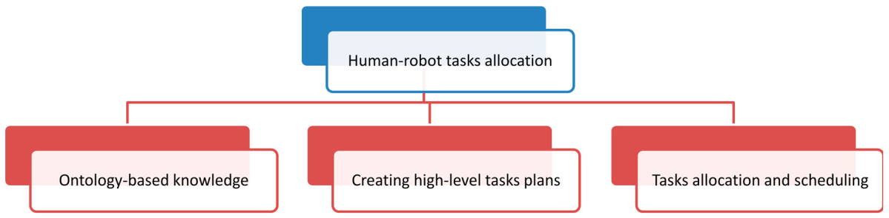

# Braço Robótico e Humano Desempenham Tarefas de forma Colaborativa

# State of the Art

## 2019 - Human–robot interaction in industrial collaborative robotics: a literature review of the decade

- **HRI -** the process of conveying human intentions and interpreting task descriptions into a sequence of robot motions complying with robot capabilities and working requirements

#### Criteria for HRI

- **Workspace:** the overlapping space in the working range of human and robot is described as the common workspace.
- **Working time:** it is defined as the time the participant is working inside the workspace.
- **Aim:** every entity of the interacting team has an aim to achieve. This aim can match or mismatch with the other one.
- **Contact:** since human and robot share the same workspace, they may come into contact with each other either [16] (i) occasionally or by accident if normal operation is intended to be without contact, or (ii) on purpose if the operator is supposed to work in contact with the robot, exchanging forces and cooperating in action upon on the environment.

#### Classification of HRI

- **Human–Robot Coexistence (HRCx)**, also called coaction, is defined [17] as the capability of sharing the dynamic workspace between humans and robots without a common task (operate on dissimilar tasks) [18,19] or, without requiring mutual contact or coordination of actions [20] and intentions (human and robot may have different aims) [21]. It is generally limited to collisions avoidance.
- **Human–Robot Cooperation (HRCp)** acts on a higher level [22] than HRCx. In such a case, humans and robots are working on the same purpose and fulfill the requirements of time and space, simultaneously. The cooperation requires thus advanced technologies such as force-feedback sensing or advanced machine vision [1,17], and far more sensing techniques for collision detection and avoidance.
- **Human–Robot Collaboration (HRC)** is the feature of performing a complex task with direct human inter-action in two different modalities [21]: 
  - (i) Physical collaboration where an explicit and intentional contact with forces exchange exists between human and robot [23]. By measuring or estimating these forces/torques [10], the robot can predict human motion intentions and react accordingly [24,25]. 
  - (ii) Contactless collaboration where no physical interaction exists. In such a case, actions are coordinated from information exchange which can be achieved via direct communication (speech, gestures, etc.), or indirect communication (intentions recognition, eye gaze direction, facial expressions, etc.) [26,27]. In such scenarios, the operator performs task parts requiring dexterity or decision-making, while the robot realizes parts that are not well suited to direct human involvement (repetitive or high-force applications, chemical deposition, precision placement, etc.)

> Boa tabela de comparação de artigos

#### Safety in Industrial Robots

- Distributed real-time approach based on a 3D simulation [117]
  - 121, 122, 123, 304
- Real-time collision avoidance approach based on depth sensor [119]
- Pre-collision algorithms and virtual reality tools [154]

> Capítulo com bué conteudo em referências

#### Cognitive Human Robot Interactions

- Human actions recognition [192-194]
- Gestures recognition [201]
  - Control interface to teleoperate robot based on hand gestures using ROS [304]
- Faces Recognition [202]
- Voice Commanding [206]
- Social gaze and social acceptance [195]

#### Robot Programming Approaches

- Generation of Robotic Skills [216]
- Augmented and Virtual Reality [215]
- On-line Programming [217]
- Programming by Demonstration
  - Muitas referências sobre ensinar robots a fazer tarefas apenas por demonstração

#### Human Robot Tasks Allocation

- Ontology-based Knowledge
  - Simplify user interface [93, 222]
  - Generic knowledge based system architecture for cobots [40]
- Creating high-level tasks plans
  - Behavior Trees [228]
  - CoSTAR framework [229]
  - Skill Based System software in ROS [304]
  - XRob platfoem for HRI [230]
  - Architecture for interactive multi-modal industrial HRI [231]
- Tasks Allocation and Scheduling
  - Decision-making method that allows human-robot task allocation integrated within ROS [197]
  - Allocating tasks to humans and robots for cell manufactoring [235]
  - Analytic Hirarchy Process as a decision-making approach and Hierarchical Task Analysis [324]

#### Fault Tolerance

- Error Detection
- Error Diagnosis
- Recovery

#### Open Issues on Cobots

- Paper importante [325]

- Facilitating Human–Robot Collaborative Tasks by TLC From Human Demonstrations - 2019
- Toward Safe Close-Proximity Human-Robot Interaction with Standard Industrial Robots - 2014
- Survey on Human-Robot Interaction for Robot Programming in Industrial Applications - 2018
- Safety in Human-Robot Collaboration - 2016
- Human-Robot Interaction for Cooperative Manipulation - 2007
- Human-Robot Collaboration in Manufacturing Applications - 2019
- Emerging Research Fields in Safety and Ergonomics in Industrial Collaborative Robotics - 2020
