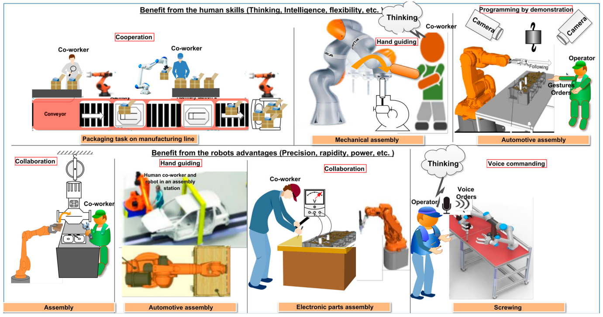
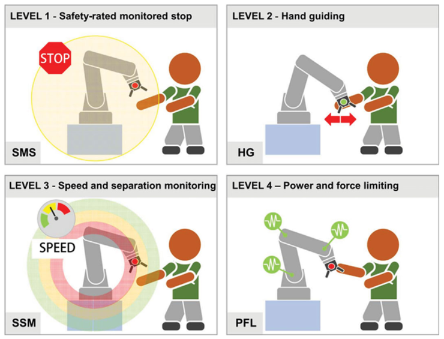
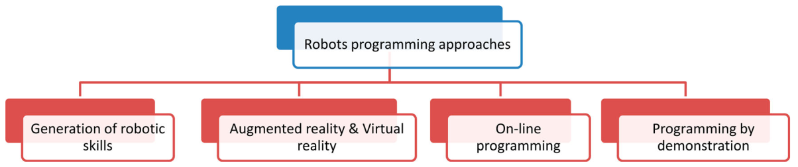

# State of The Art Research

## 1 - 2019 - Human–robot interaction in industrial collaborative robotics: a literature review of the decade

- **HRI -** the process of conveying human intentions and interpreting task descriptions into a sequence of robot motions complying with robot capabilities and working requirements

#### Criteria for HRI

- **Workspace:** the overlapping space in the working range of human and robot is described as the common workspace.
- **Working time:** it is defined as the time the participant is working inside the workspace.
- **Aim:** every entity of the interacting team has an aim to achieve. This aim can match or mismatch with the other one.
- **Contact:** since human and robot share the same workspace, they may come into contact with each other either [16] (i) occasionally or by accident if normal operation is intended to be without contact, or (ii) on purpose if the operator is supposed to work in contact with the robot, exchanging forces and cooperating in action upon on the environment.

#### Classification of HRI

- **Human–Robot Coexistence (HRCx)**, also called coaction, is defined [17] as the capability of sharing the dynamic workspace between humans and robots without a common task (operate on dissimilar tasks) [18,19] or, without requiring mutual contact or coordination of actions [20] and intentions (human and robot may have different aims) [21]. It is generally limited to collisions avoidance.
- **Human–Robot Cooperation (HRCp)** acts on a higher level [22] than HRCx. In such a case, humans and robots are working on the same purpose and fulfill the requirements of time and space, simultaneously. The cooperation requires thus advanced technologies such as force-feedback sensing or advanced machine vision [1,17], and far more sensing techniques for collision detection and avoidance.
- **Human–Robot Collaboration (HRC)** is the feature of performing a complex task with direct human inter-action in two different modalities [21]: 
  - (i) Physical collaboration where an explicit and intentional contact with forces exchange exists between human and robot [23]. By measuring or estimating these forces/torques [10], the robot can predict human motion intentions and react accordingly [24,25]. 
  - (ii) Contactless collaboration where no physical interaction exists. In such a case, actions are coordinated from information exchange which can be achieved via direct communication (speech, gestures, etc.), or indirect communication (intentions recognition, eye gaze direction, facial expressions, etc.) [26,27]. In such scenarios, the operator performs task parts requiring dexterity or decision-making, while the robot realizes parts that are not well suited to direct human involvement (repetitive or high-force applications, chemical deposition, precision placement, etc.)

> Boa tabela de comparação de artigos

#### Safety in Industrial Robots

- Distributed real-time approach based on a 3D simulation [117]
  - 121, 122, 123, 304
- Real-time collision avoidance approach based on depth sensor [119]
- Pre-collision algorithms and virtual reality tools [154]

> Capítulo com bué conteudo em referências

#### Cognitive Human Robot Interactions

- Human actions recognition [192-194]
- Gestures recognition [201]
  - Control interface to teleoperate robot based on hand gestures using ROS [304]
- Faces Recognition [202]
- Voice Commanding [206]
- Social gaze and social acceptance [195]

#### Robot Programming Approaches

- Generation of Robotic Skills [216]
- Augmented and Virtual Reality [215]
- On-line Programming [217]
- Programming by Demonstration
  - Muitas referências sobre ensinar robots a fazer tarefas apenas por demonstração

#### Human Robot Tasks Allocation

- Ontology-based Knowledge
  - Simplify user interface [93, 222]
  - Generic knowledge based system architecture for cobots [40]
- Creating high-level tasks plans
  - Behavior Trees [228]
  - CoSTAR framework [229]
  - Skill Based System software in ROS [304]
  - XRob platfoem for HRI [230]
  - Architecture for interactive multi-modal industrial HRI [231]
- Tasks Allocation and Scheduling
  - Decision-making method that allows human-robot task allocation integrated within ROS [197]
  - Allocating tasks to humans and robots for cell manufactoring [235]
  - Analytic Hirarchy Process as a decision-making approach and Hierarchical Task Analysis [324]

#### Fault Tolerance

- Error Detection
- Error Diagnosis
- Recovery

### Papers Para Ler

- [7] - Human centered assistance applications for the working environment of the future. 2015
- [14] - Evaluation of flexible graphical user interface for intuitive human robot interactions. 2014
- [18] - Integration of active and passive compliance control for safe human-robot coexistence. 2009
- [19] - A design approach for incorporating task coordination for human-robot coexistence within assembly systems. 2015
- [21] - Integrated control for PHRI: collision avoidance, detection, reaction and collaboration. 2012
- [22] - A brief review on safety strategies of physical human-robot interaction. 2019
- [23] - A depth space approach for evaluating distance to objects. 2015
- [24] - Multimodal control for human-robot cooperation. 2013
- [27] - Planning safe and legible hand-over motions for human-robot interaction. 2010
- [28] - Study on application of a human-robot collaborative system using hand-guiding in a production line. 2016
- [44] - Ros based coordination of human robot cooperative assembly tasks. 2015
- [49] - Human-robot physical interaction and collaboration using an industrial robot with a closed control architecture. 2013
- [55] - Optimized assistive human–robot interaction using reinforcement learning. 2016
- [60] - Introducing robots without creating fear of unemployment and high cost in industries. 2018
- [70] - Human-robot collaboration for tooling path guidance. 2016
- [88] - Real-time computation of distance to dynamic obstacles with multiple depth sensors. 2016
- [100] - Working together: a review on safe human-robot collaboration in industrial environments. 2017
- [104] - Toward safe human robot collaboration by using multiple kinects based real-time human tracking. 2014
- [117] - A real time distributed approach to collision avoidance for industrial manipulators. 2014
- [119] - A depth space approach to human-robot collision avoidance. 2012
- [124] - A general procedure for collision detection between an industrial robot and the environment. 2015
- [167] - Cooperative tasks between humans and robots in industrial environments. 2012
- [170] - Safety-aware trajectory scaling for human-robot collaboration with prediction of human occupancy. 2015
- [190] - Design of a collaborative architecture for human-robot assembly tasks. 2017
- [191] - A user-adaptive gesture recognition system applied to human-robot collaboration in factories. 2016
- [192] - Action recognition for human robot interaction in industrial applications. 2015
- [195] - A proposed gesture set for the control of industrial collaborative robots. 2012
- [197] - On a human-robot collaboration in an assembly cell. 2017
- [200] - Dynamic time warping for gesture-based user identification and authentication with kinect. 2013
- [217] - Intuitive and model-based on-line programming of industrial robots: a modular on-line programming environment. 2008
- [218] - Spatial programming for industrial robots through task demonstration. 2013
- [221] - Human–robot interaction review and challenges on task planning and programming. 2016
- [229] - Costar: instructing collaborative robots with behavior trees and vision. 2017
- [288] - How human-robot teamwork will upend manufacturing. 2014
- [293] - Manual guidance for industrial robot programming. 2015
- [310] - On a new generation of torque controlled light-weight robots. 2001
- [319] - Collision-free motion planning for human-robot collaborative safety under cartesian constraint. 2018
- [321] - Survey on human–robot collaboration in industrial settings: safety, intuitive interfaces and applications. 2018
- [325] - Key challenges and open issues of industrial collaborative robotics. 2018

## 2 - 2019 - Human–Robot Collaboration in Manufacturing Applications: A Review

- Concept of cobots invented in 1996 [2]
- Classification of human robot interaction [7]
  - **Coexistence - **Human operator and cobot are in the ame environment but do not interact with each other
  - **Synchronised - **Human operator and cobot work in the same workspace, but at different times
  - **Cooperation - **Human operator and cobot work in the same workspace at the same time, though focusing on separate tasks
  - **Collaboration - **Human operator and the cobot must execute a task together, the action of the one has immediate consequences on the other, thaks to special sensors and vision systems

- Other classifications [8-11]
- Safety requirements for cobots
  - **Safety-rated Monitored Stop (SMS) - **used to cease robot motion in the collabortice workspace before an operator enter the collaborative workspace
  - **Hand-guiding (HG) - **where an operator uses a hand-operated device, locate at or nead the robot end-effector, to transmit motion commands to the robot
  - **Speed and separation monitoring (SSM) - **where the robot system and operator may move concurrently in the collaborative workspace. During robot motion, the orbot system never gets closer to the operator than the protective separaton distance
  - **Power and force limitting (PFL) - **where the robot system shall be designed to adequatly reduce risk to an operator by not exceeding the applicable threshlod limit values
- Defined in [13], cobots should be equipped with additional features such as force and toque sensors, force limits, vision systems (cameras), laser systems, anti-collision systems, recognition of voice commands, and / or system to coordinate the actions of human operators with their motion
- Robot learning from demonstratoin [15] - **IMPORTANTE**
- Table comparing humans, cobots and tobots
  - Assembly - attatching 2 or more components
  - Placement - positiong each part in the proper position
  - Handling - manipulation of the picked part
  - Picking - tacking from the feeding point

- Collaborative robots are especially advantageous for assembly tasks, particularly if the task is executed with a human operator. They are also suitable for pick and place applications, though the adoption of a traditional robot or a handling system can offer better results in terms of speed, precision, and payload
- Aplications of cobots in this review
  - Assembly - when the cobot collaborated with the operator in an assembly process
  - Human Assistance - when the cobot acts as an ergonomic support for the operator
  - Machine Tending - when the cobot performs loading / unloading operations
- Physical human-robot interaction in 6DOF [28] - **IMPORTANTE**
- End-effector precise hand-guiding for collaborative robots [30] - **IMPORTANTE**
- **Results of the review**
  - Cobots are being researched more than tobots
  - The most used control system is vision
  - The most used methodologie was hand guiding but the others were aso used
  - The most researched task was assembly, by a large margin
  - To increase safety, productivity and task performance, researchers will need to improve planners, environment and task understanding, operator intention understanding and ergonomic cell setups
  - To imporve HRI systems, common future work focuses on increasing the robots' and operators' awareness of the task and environment by object redognition and integrating multi-modal sensing in an intuitive manner for the operator
- **Trends of Market**
  - Robot market is going ot grow
  - The fall in robot prices has led to a growing market for cobots
  - Small and medium sized enterprises could not afford robotic applications due to the high capital costs
- Trust-based compliant robot-human handovers of payloads [29] - **IMPORTANTE**
- Table with the reviewed papers

### Papers Para Ler

- [15] - Robot learning from demonstration in robotic assembly: A survey. 2018
- [28] - Physical human–robot interaction (pHRI) in 6 DOF with asymmetric cooperation. 2017
- [29] - Trust-based compliant robot-human handovers of payloads in collaborative assembly in flexible manufacturing. 2016
- [30] - End-effector precise hand-guiding for collaborative robots. 2017
- **Faltam alguns**

## 3 - 2020 - Safe Collaborative Robotic Manipulators

## 4 - 2019 - On-line collision avoidance for collaborative robot manipulators by adjusting off-line generated paths

- 2012 - A depth space approach to human-robot collision avoidance.
  - Depth data from a Kinect camera for calculating distances between the human and reference points on the robot
- 1986 - Real-time obstacle avoidance for manipulators and mobile robots
  - real-time obstacle avoidance approach based on the classical artificial potential field (PF)
- [14 - 29] - Multiplos papers sobre collision avoidance em manipuladores robóticos

##### 2 Problemas em Human Robot collision avoidance

- Dificuldade em obter com confiança a pose do humano
- Dificuldade em criar movimentos suaves e contínuos enquanto se gera trajetórias sem colisões

##### Repulsion

- Utiliza a configuração atual do robot
- O ponto mais próximo do obstáculo mais próximo
- Constantes de distâncias
- A velocidade do obstáculo (irrelevante)
- Para evitar discotinuidade no movimento quando aparece um obstáculo, é introduzido o concento de coeficiente de alteração do vetor de repulsão, que permite que a magnitude de repulsao possa crescer de zero a um valor estável

##### Attraction

- Utiliza o erro entre a posição do EE e a posição de meta (definida na trajetoria offline)

- Também utiliza distância mínima ao obstáculo para controlo de velocidade

##### Controlador

- Robot é controlado ao nível da velocidade das juntas
- Tradução de velocidades de atração/repulão para juntas utilizado o método Damped Least Squares
  - 2004 - Introduction to inverse kinematics with jacobian transpose, pseudoinverse and damped least squares methods
- Calculo das velocidades de juntas feito em 2 fases
  - Devido a repulsão utilizado o vetor repulsão e a Jacobiana do ponto mais próximo
  - Devido a atração utilizaod o vetor atração e a Jacobiana do EEF

##### Experiments and Results

- Irrelevante

## 5 - 2016 - Robot manipulator self-identification for surrounding obstacle detection

- Diferença entre setups eye-in-hand e eye-to-hand juntamente com referencias de outros artigos no capítulo de Introduction
- Definição de self-identification - process to identify the robot itself in the 3D point cloud
- Métodos simples de robot self-identification [7, 10, 15, 20]
- Enfase que este trabalho nao depende do modelo 3D do robot (referir que se calhar é mais lento dessa forma e estamos a tnetar executar em real-time)
- Boa forma de expor algoritmos (com input, output e o algoritmo em si)

##### Preliminaries

- Bom capítulo para explicar a informação teórica e o hardware utilizado no paper
- Método simples de calibração em 2.3 com apenas 4 pontos 

##### Collision Prediction

- Criação de uma Region of Interest baseada no esqueleto do robot para apenas utilizar os pontos pertencentes a ela
- Criação de pontos de interpolação entre cada par de juntas adjacentes
- A distancia de um ponto ao robot é dada pelo minimo das distancia do ponto aos pontos de interpolação 

- Criação de superpixels baseado no método k-menas clustering 
- O objetivo do algoritmo de self-identification deles é criar esferas em cada ponto de interpolação e estimar o seu raio com base na point cloud segmentada
- Utilizam um valor de threshlod de distancia minima para calcular que superpixeis pertencem ao robot

##### Robot Control

- Referencia à matriz jacobiana para o calculo da velocidade do EEF
- 3 equações de calculo de velocidades de collision avoidances baseadas na distancia corrente do obstaculo ao robot e em 2 valores de threshold de distancia

##### Experiments and Results

- Irrelevante

## 6 - 2015 - Optimizing the Universal Robots ROS Driver

- Relatório que analisa o estado corrente (2015) do driver ROS dos Universal Robots
- Várias formas de contorlo do robot (informação conhecida)
- Modo de funcionamento do ur_driver (irrelevante)
- Explicação de comandos URScript (irrelevante)
- Explicação de como o novo driver, escrito em C++ interaje com o robot 
  - Utiliza o comando servoJ internamente para execução de trajetórias

## 7 - 2017 - Real-Time Control of Robots with ROS

- Boa introdução / síntese sobre ROS e Universal Robots
- De resto não tem grande informação... Basicamente são melhoramentos ao driver antigo do robot

