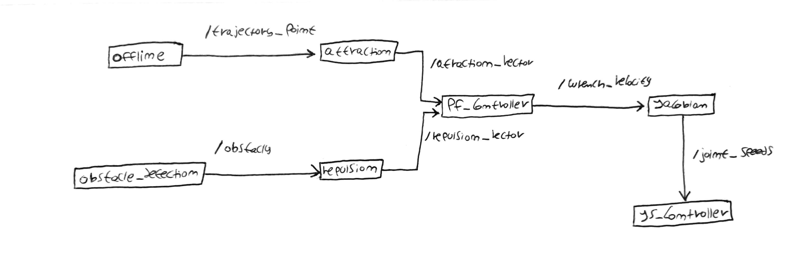

# Safe Path Planing

## Obstacle Detection

#### Robot Self-Identification

#### Obstacle Identification

### Potential Fields Method

#### Attraction

#### Repulsion

#### Controller

### Architecture

