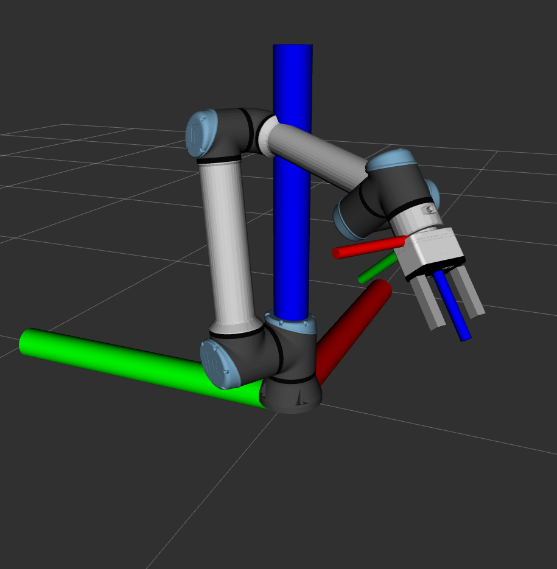
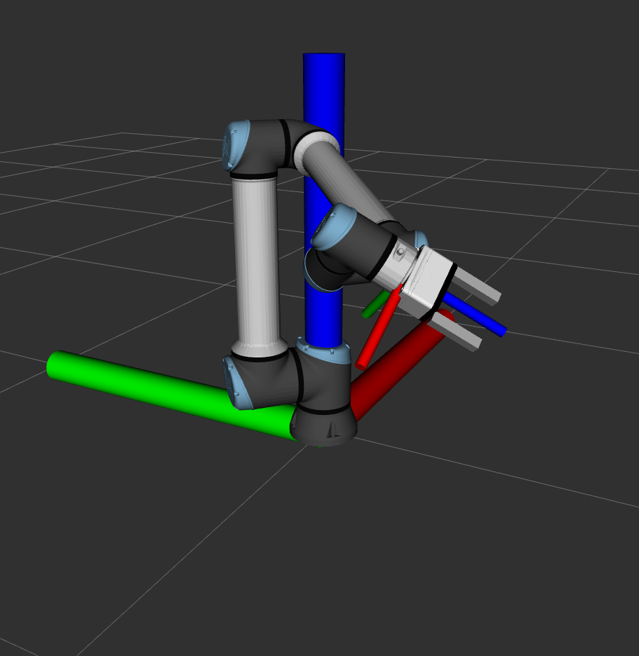

# Test Wrench w/Gripper

## Orientations

​								Wrist 3 = - 90																	 Wrist 3 = 0																		Wrist 3 = 90	

## Test

- In various positios
  - Put Wrist 3 = 0
  - Zero FT Sensor
  - Take samples of XYZ force values from /wrench in each Wrist 3 joint angle from -180 to 180

### 5 Tests Varying Orientation in Y

### 2 Tests Varying Orientation in Z

