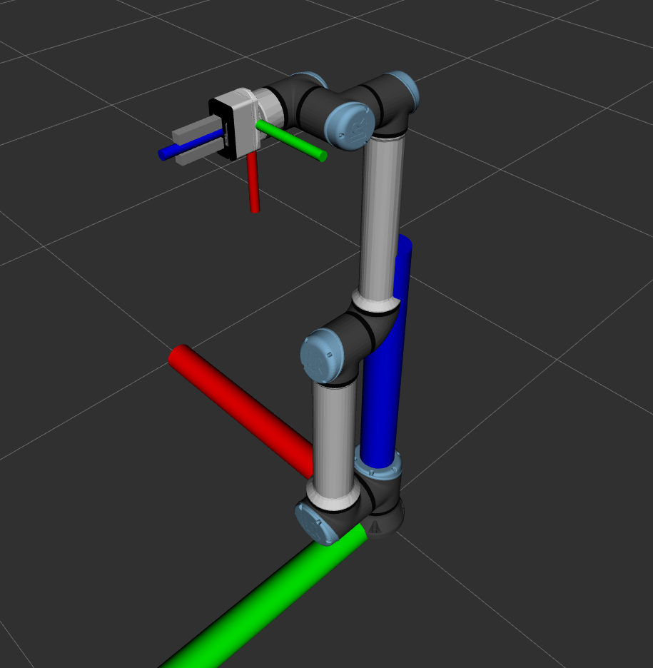

# Test Wrench w/o Gripper

## Test

- In various positios
  - Put Wrist 3 = 0
  - Zero FT Sensor
  - Take samples of XYZ force values from /wrench in each Wrist 3 joint angle from -180 to 180

### 5 Tests Varying Orientation in Y

### Tests in Other Positions

### Testing the Zero FT Sensor Behavior

#### Zero FT Sensor at 0

#### Zero FT Sensor at 100

#### Zero FT Sensor at -100

